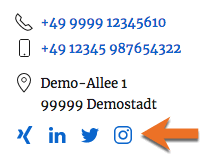

# inx_team_agency_network_icons_output (Filter)

Dieser Filter-Hook bietet die Möglichkeit, den bereits gerenderten HTML-Code von **Icon-Listen** mit verlinkten Netzwerk-Profilseiten von Agenturen vor der Ausgabe zu verändern. Die Icon-Listen kommen – sofern entsprechende URLs vorhanden sind – in den Detailansichten und Widgets der Agenturen zum Einsatz.)



## Parameter

| Name (Typ) | Beschreibung |
| ---------- | ------------ |
| `$html` (string) | gerenderter HTML-Code für die Ausgabe der Netzwerk-Icons/Links |

## Rückgabewert

angepasster HTML-Code

## Rahmenfunktion

[](_info-snippet-einbindung.md ':include')

```php
add_filter( 'inx_team_agency_networks', 'mysite_modify_agency_network_icons_output' );

function mysite_modify_agency_network_icons_output( $html ) {
	// HTML-Code vor der Ausgabe anpassen.
	// $html = str_replace( 'xxx', 'yyy', $html );

	return $html;
} // mysite_modify_agency_network_icons_output
```

[](_backlink.md ':include')