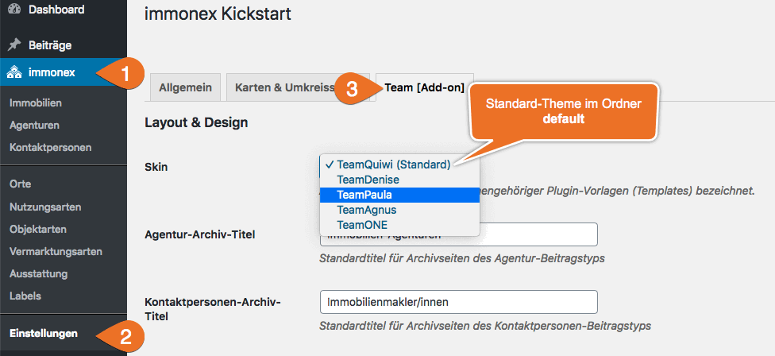

# Skins

Ein <i>Skin</i> ist - technisch gesehen - ein einfacher Ordner, der alle für die Darstellung im **Website-Frontend** maßgeblichen Ressourcen in (möglichst) einheitlicher, strukturierter Form enthält:

- Templates (PHP)
- JavaScript-Dateien
- CSS-Dateien
- Bilddateien
- Fonts

## Ordner

### Add-on Skins

**Mitgelieferte** Skins sind im **Plugin-Verzeichnis des Kickstart-Add-ons** unter `skins` zu finden:

`.../wp-content/plugins/immonex-kickstart-team/skins/`

Aktuell ist hier nur der Ordner des Standard-Skins <i>TeamQuiwi</i> enthalten (`default`):

`.../wp-content/plugins/immonex-kickstart-team/skins/default`

> Die Ordnernamen sind unabhängig vom eigentlichen (angezeigten) Skin-Namen, der in der Datei index.php festgelegt wird.

### Custom Skins

Der passende und *update-sichere* Ort für **eigene oder angepasste** Skins ist der Unterordner `immonex-kickstart-team` im **(Child-)Theme-Verzeichnis**:

`.../wp-content/themes/(CHILD-)THEME-NAME/immonex-kickstart/`

## Auswahl



[Skin-Auswahl](../schnellstart/einrichtung.html#Skin) unter ***immonex → Einstellungen → Team [Add-on]***

Die zugehörige Ordner-Struktur könnte so aussehen:
```
.../wp-content/plugins/immonex-kickstart-team/skins
└── default

.../wp-content/themes/(CHILD-)THEME-NAME/immonex-kickstart-team
├── denise
├── paula
├── agnus
└── one
 ```

## Aufbau

Der **grundlegende** Aufbau eines Kickstart-Skins ist denkbar einfach:
```
skin-name
├── css
│   └── index.css
├── js
│   └── index.js
└── index.php
```

Die Dateien `index.css` und `index.js` des aktiven Skins werden im Frontend automatisch eingebunden. Je nach Umfang bietet es sich an, bei der Entwicklung mit mehreren Quelldateien zu arbeiten, die anschließend per Bundler bzw. Präprozessor à la [webpack](https://webpack.js.org/), [Sass](https://sass-lang.com/) & Co. kompiliert werden – Infos hierzu in der [Dokumentation des Kickstart-Basisplugins](https://docs.immonex.de/kickstart/anpassung-erweiterung/skins.html#Komplett).

Die Datei `index.php` enthält nur den Namen des Skins für die Ausgabe:

```php
<?php
/**
 * Skin Name: Quiwi
 */

die( "Don't event think about it!" );
```

## Individuelle Anpassung

### Partiell

Ist ein mitgeliefertes Add-on-Skin grundsätzlich passend und sollen nur geringfügige optische Anpassungen vorgenommen werden, ist in den meisten Fällen das [Überschreiben bzw. Ergänzen der betreffenden CSS-Stile](index.html) via Customizer ausreichend. Auch bei weitergehenden Änderungen muss aber **nicht** zwingend mit einem individuellen Skin mit vollem Dateiumfang ([Custom Skin](https://docs.immonex.de/kickstart/anpassung-erweiterung/standard-skin.html)) gearbeitet werden.

Stattdessen besteht die Möglichkeit, nur die zu anzupassenden Dateien eines  vorhandenes Plugin-Skins im (Child-)Theme-Ordner zu überschreiben, dessen Name dem des Basis-Skin-Ordners (im Plugin-Verzeichnis) entspricht.

Sollen bspw. nur eigene Varianten der Dateien `index.css` und `single-agency.php` zum Einsatz kommen, alles andere aber weiterhin vom Standard-Skin (Ordnername `default`) übernommen werden, ergibt sich bspw. die folgende Struktur:

#### Standard-Skin-Ordner (Plugin-Verzeichnis)

```
.../wp-content/plugins/immonex-kickstart-team/skins
└── default
    ├── css
    │   └── index.css
    ├── agency-list
    ├── agent-list
    ├── js
    ├── mail
    ├── single-agency
    ├── single-agent
    ├── archive-agency.php
    ├── archive-agent.php
    ├── contact-form.php
    ├── index.php
    ├── single-agency.php
    └── single-agent.php
```

#### Skin-Ordner mit angepassten Dateien (Theme/Child-Theme)

```
.../wp-content/themes/(CHILD-)THEME-NAME/immonex-kickstart-team
└── default
    ├── css
    │   └── index.css
    └── single-agency.php
```

### Komplett

Sollen umfangreiche Anpassungen oder einer ganz individuelle Darstellung umgesetzt werden, ist ein vollständig **benutzerdefiniertes Skin** (<i>Custom Add-on Skin</i>) die passende Wahl. Hier kann wiederum das Standard-Skin als Basis verwendet und schrittweise angepasst werden.

Die Vorgehensweise entspricht hierbei der Entwicklung von [Custom Skins für das Kickstart-Basis-Plugin](https://docs.immonex.de/kickstart/anpassung-erweiterung/skins.html#Komplett).
