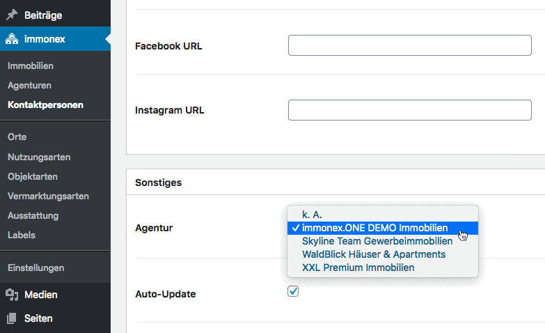
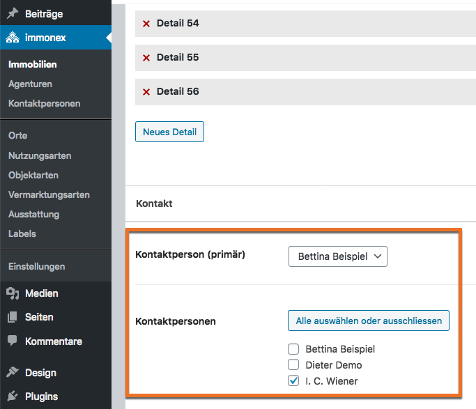

# Beitragsarten

## Custom Post Types

Für **Immobilien-Agenturen** und **Kontaktpersonen** werden die folgenden benutzerdefinierten Beitragsarten (<i>Custom Post Types</i> oder kurz <i>CPT</i>) registriert:

- *inx_agency* (Agenturen)
- *inx_agent* (Kontaktpersonen nachfolgend auch als <i>Immobilienmakler/innen</i>, <i>Ansprechpartner/innen</i> oder <i>Agenten</i> bezeichnet)

### Agentur > Kontaktperson

Eine Kontaktperson ist im Regelfall einer (einzelnen) Agentur zugeordnet.

### Kontaktperson/Agentur > Immobilie

Einem importierten Immobilienobjekt (CPT *inx_property* des [Kickstart-Basisplugins](https://docs.immonex.de/kickstart/)) können grundsätzlich mehrere Kontaktpersonen zugeordnet werden, wobei aber nur eine hiervon den *primären* Kontakt darstellt. Über diese **primäre Kontaktperson** wird wiederum eine Verbindung zwischen einem Immobilien-Angebot und einer Agentur hergestellt.

## Custom Fields

Die Eigenschaften der Agenturen und Kontaktpersonen werden durch eine Reihe von benutzerdefinierten Feldern definiert bzw. ergänzt, die weitgehend an die entsprechenden Strukturen des OpenImmo-Standards angelehnt sind.

### Agenturen (inx_agency)

#### Kontaktdaten

Bei den folgenden Angaben zur Agentur handelt es sich vornehmlich um **allgemeine** Kontaktdaten (Haupt-Rufnummer/E-Mail etc.), die sich **nicht** auf eine bestimmte Kontaktperson beziehen.

| Feldname | Beschreibung |
| -------- | ------------ |
| `_inx_team_agency_email` | Mailadresse |
| `_inx_team_agency_phone` | Telefonnummer |
| `_inx_team_agency_fax` | Faxnummer |
| `_inx_team_agency_url` | Website-URL |
| `_inx_team_agency_street` | Straße |
| `_inx_team_agency_house_number` | Hausnummer |
| `_inx_team_agency_zip_code` | Postleitzahl |
| `_inx_team_agency_city` | Ort |
| `_inx_team_agency_po_box` | Postfach(nummer) |
| `_inx_team_agency_po_box_zip_code` | Postfach-PLZ |
| `_inx_team_agency_po_box_city` | Postfach-Ort |
| `_inx_team_agency_country_iso` | dreistelliger Ländercode ([ISO 3166 ALPHA-3](https://de.wikipedia.org/wiki/ISO-3166-1-Kodierliste)) |

#### Business/Soziale Netzwerke

Die Netzwerk-Liste kann bei Bedarf per [Filterfunktion](anpassung-erweiterung/filter-inx-team-agency-networks.html) modifiziert werden. Die URLs gehören nicht zum regulären Umfang des OpenImmo-Standards, müssen also bei Bedarf manuell oder mit einer individuellen Hook-Funktion ergänzt werden.

| Feldname | Beschreibung |
| -------- | ------------ |
| `_inx_team_agency_xing_url` | XING-URL (Unternehmensprofil) |
| `_inx_team_agency_linkedin_url` | LinkedIn-URL (Unternehmensprofil) |
| `_inx_team_agency_twitter_url` | Twitter-URL |
| `_inx_team_agency_facebook_url` | URL der Facebook-Seite des Unternehmens |
| `_inx_team_agency_instagram_url` | Instagram-URL |

#### Rechtliches/Impressum

Die für das Impressum relevanten rechtlichen Angaben werden beim Import mit berücksichtigt, aber standardmäßig **nicht** ausgegeben. (Im Regelfall ist das Impressum als separate Seite mit individuellen Inhalten vorhanden.)

| Feldname | Beschreibung |
| -------- | ------------ |
| `_inx_team_agency_legal_company` | Firma inkl. Rechtsform (Impressum) |
| `_inx_team_agency_legal_address` | Anschrift (Impressum) |
| `_inx_team_agency_legal_phone` | Telefonnummer (Impressum) |
| `_inx_team_agency_representative` | für Inhalte verantwortliche Person (Impressum) |
| `_inx_team_agency_supervisory_authority` | Aufsichtsbehörde gem. § 34c GewO (Impressum) |
| `_inx_team_agency_registry_court` | Registergericht (Handelsregister) |
| `_inx_team_agency_trade_register_number` | Handelsregisternummer |
| `_inx_team_agency_vatin` | USt-ID |
| `_inx_team_agency_legal_misc` | weitere rechtliche Angaben (Impressum) |
| `_inx_team_agency_legal_notice` | Sonstiges/Anmerkungen (Impressum) |

#### Verarbeitung/Spezial-Flags

| Feldname | Beschreibung |
| -------- | ------------ |
| `_inx_team_agency_auto_update`Flag | Kontaktdaten beim OpenImmo-Import aktualisieren? Voreinstellung: **aktiv** (*1*) |
| `_inx_team_agency_address_publishing_approved`Flag | Adresse zur Veröffentlichung freigegeben? Voreinstellung: **aktiv** (*1*) |
| `_immonex_import_folder` | Importordner beim Anlegen des Beitrags (sollte **nicht** bzw. nur in Ausnahmefällen manuell geändert werden) |
| `_openimmo_anid` | zugehörige OpenImmo-Anbieter-ID (ANID), die beim Import übermittelt wurde |
| `_immonex_is_demo`Flag | Demo/Beispieldaten? Wenn aktiv (*1*), werden entsprechende Meldungen bzw. Labels im Frontend angezeigt, zudem erfolgt kein Versand von zugehörigen Kontaktformular-Daten. |

### Kontaktpersonen (inx_agent)

#### Allgemein

Vor- und Nachname werden bei der automatisierten Erstellung eines Beitrags als Beitragstitel übernommen.

| Feldname | Beschreibung |
| -------- | ------------ |
| `_inx_team_agent_gender` | Geschlecht (*m*, *w* oder *x*) - relevant bei "genderspezifischen" Überschriften |
| `_inx_team_agent_title` | Titel (z. B. Dr.) |
| `_inx_team_agent_first_name` | Vorname |
| `_inx_team_agent_last_name` | Nachname |
| `_inx_team_agent_position` | Position im Unternehmen oder Berufsbezeichnung |

#### Kontaktdaten

| Feldname | Beschreibung |
| -------- | ------------ |
| `_inx_team_agent_email` | Mailadresse (direkt) |
| `_inx_team_agent_email_main_office` | Mailadresse (Zentrale) |
| `_inx_team_agent_email_feedback` | Mailadresse (Feedback - speziell für objektbezogene Formular-Anfragen) |
| `_inx_team_agent_email_private` | Mailadresse (privat - aktuell **keine** Ausgabe oder anderweitige Verwendung vorgesehen) |
| `_inx_team_agent_phone` | Telefonnummer (Durchwahl) |
| `_inx_team_agent_phone_mobile` | Telefonnummer (mobil) |
| `_inx_team_agent_phone_main_office` | Telefonnummer (Zentrale) |
| `_inx_team_agent_phone_private` | Telefonnummer (privat - aktuell **keine** Ausgabe oder anderweitige Verwendung vorgesehen) |
| `_inx_team_agent_fax` | Faxnummer |
| `_inx_team_agent_company` | Firma |
| `_inx_team_agent_url` | Website-URL (Unternehmen) |
| `_inx_team_agent_street` | Straße |
| `_inx_team_agent_house_number` | Hausnummer |
| `_inx_team_agent_zip_code` | Postleitzahl |
| `_inx_team_agent_city` | Ort |
| `_inx_team_agent_po_box` | Postfach(nummer) |
| `_inx_team_agent_po_box_zip_code` | Postfach-PLZ |
| `_inx_team_agent_po_box_city` | Postfach-Ort |
| `_inx_team_agent_country_iso` | dreistelliger Ländercode ([ISO 3166 ALPHA-3](https://de.wikipedia.org/wiki/ISO-3166-1-Kodierliste)) |

#### Business/Soziale Netzwerke

| Feldname | Beschreibung |
| -------- | ------------ |
| `_inx_team_agent_xing_url` | XING-URL (Unternehmensprofil) |
| `_inx_team_agent_linkedin_url` | LinkedIn-URL (Unternehmensprofil) |
| `_inx_team_agent_twitter_url` | Twitter-URL |
| `_inx_team_agent_facebook_url` | URL der Facebook-Seite des Unternehmens |
| `_inx_team_agent_instagram_url` | Instagram-URL |

Auch hier gilt: Anpassung/Erweiterung per [Filterfunktion](anpassung-erweiterung/filter-inx-team-agent-networks.html) möglich

#### Verarbeitung/Spezial-Flags etc.

| Feldname | Beschreibung |
| -------- | ------------ |
| `_inx_team_agency_id` | ID der Agentur (Beitrag), zu dem die Kontaktperson gehört (optional) |
| `_inx_team_agent_auto_update`Flag | Kontaktdaten beim OpenImmo-Import aktualisieren? Voreinstellung: **aktiv** (*1*) |
| `_inx_team_agent_address_publishing_approved`Flag | Adresse zur Veröffentlichung freigegeben? Voreinstellung: **aktiv** (*1*) |
| `_immonex_import_folder` | Importordner beim Anlegen des Beitrags (sollte **nicht** bzw. nur in Ausnahmefällen manuell geändert werden) |
| `_inx_team_agent_personal_number` | Personennummer (aktuell **keine** Ausgabe oder anderweitige Verwendung vorgesehen) |
| `_inx_team_property_trustee_id` | Immobilien-Treuhänder-ID (aktuell **keine** Ausgabe oder anderweitige Verwendung vorgesehen) |
| `_inx_team_agent_reference_id` | Referenz-ID (für zukfünftige OpenImmo-Versionen, aktuell **keine** Verwendung vorgesehen) |
| `_inx_team_agent_misc` | Hinweise/sonstige Angaben |
| `_immonex_is_demo`Flag | Demo/Beispieldaten? Wenn aktiv (*1*), werden entsprechende Meldungen bzw. Labels im Frontend angezeigt, zudem erfolgt kein Versand von zugehörigen Kontaktformular-Daten. |

