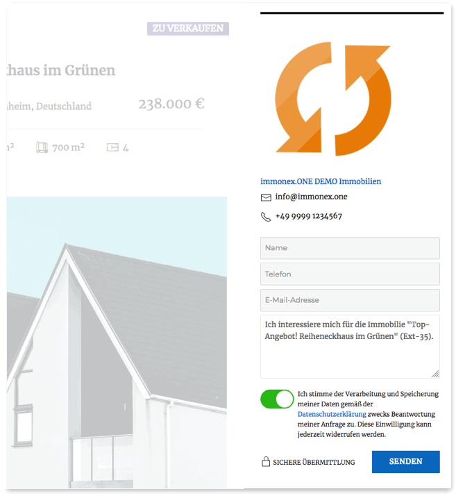

# Agentur-Details

Analog zu den Listen ist auch die Agentur-Detailansicht für Websites vorgesehen, in denen die Inhalte mehrerer Immobilienmakler-Agenturen kombiniert werden.

Es werden grundsätzlich zwei Arten der Ausgabe unterschieden: Der Umfang des **Standard-Templates** (<i>TeamQuiwi-Skin</i>) umfasst neben dem Namen und Logo (sofern vorhanden) des Unternehmens alle relevanten Kontaktdaten sowie zwei zusätzliche Abschnitte für Kontaktpersonen und Immobilienangebote, die der Agentur zugeordnet sind. Wir sprechen bei dieser Form daher auch von der **Vollansicht**.

Mit dem **Widget-Template** wird hingegen eine kompaktere Form der Agenturdaten generiert, die für die Darstellung als Teil einer Immobilien-Detailansicht optimiert ist.

## Vollansicht

Die Vollansicht einer Agentur kann "out of the box" über die Standard-Einzelansicht (im WP-Jargon <i>Single Template</i>) aufgerufen werden. Hierbei handelt es sich um eine vollständige Seite inkl. Header und Footer der Website. Das URL-Schema dieser Seiten sieht im Regelfall so aus:

`https://[WEBSITE.TLD]/immobilienmakler-agenturen/[AGENTUR-SLUG]/`1 bzw. `https://[WEBSITE.TLD]/realtors/[AGENTUR-SLUG]/`1

Hier ein Beispiel – wie immer mit <i>TeamQuiwi-Skin</i> und dem WP-Standard-Theme <i>Twenty Twenty</i>:

> Die im Screenshot enthaltene Seitennavigation bezieht sich auf die Liste der Immobilien-Angebote.

## Widget

`immonex Kickstart: Agentur`

Das Agentur-Widget soll die Kontaktaufnahme erleichtern und beinhaltet daher nur die wichtigsten Informationen in kompakter Form sowie ein **einfaches** [Kontaktformular](kontaktformular.html). Der beste Platz für das Widget ist der Sidebar-Bereich der Immobilien-Detailseiten. Da die grundlegende Widget-Optik viel vom eingesetzten Theme abhängt, muss dieses allerdings auch dafür geeignet sein.

Die Agentur, deren Daten angezeigt werden sollen, wird automatisch anhand der [primären Kontaktperson](../beitragsarten.html#Kontaktperson-Agentur-gt-Immobilie) ermittelt, die der betr. Immobilie zugewiesen ist.

Ein Frontend-Beispiel – hier wurde das gute alte WP-Standard-Theme <i>Twenty Sixteen</i> reaktiviert:

Das Widget kann via ***Design → Widgets*** oder (bei geöffneter Immobilien-Detailseite) ***Customizer → Widgets*** eingebunden und konfiguriert werden:

> Das Kontaktpersonen-Widget ist die gängigere Variante der Kontaktdaten-Einbindung.

## Shortcode

`[inx-team-agency]`

Mit diesem Shortcode kann sowohl die Vollansicht als auch das Widget in beliebige Seiten oder sonstige Inhaltselemente (z. B. Page-Builder-Content-Blöcke) eingefügt werden.

#### Attribute

Alle folgenden Attribute sind **optional**.

| Name | Beschreibung / Attributwerte |
| ---- | ---------------------------- |
| `id` | ID des Agentur-Beitrags (nur notwendig, sofern die Einbindung **nicht** als Teil eines Immobilien-Beitrags erfolgt und somit keine automatische Bestimmung möglich ist) |
| `type` | Darstellungsart - wird nur bei Einbindung als Widget benötigt (Wert ergo *widget*), Standard ist die Vollansicht |
| `title` | nur Widget: Titel/Überschrift |
| `before_title` | nur Widget: HTML-Code vor dem Titel (WP/Theme-Vorgabe überschreiben) |
| `after_title` | nur Widget: HTML-Code nach dem Titel (WP/Theme-Vorgabe überschreiben) |
| `convert_links` | *1* oder *yes*, um Mailadressen und Telefonnummern bei der Ausgabe in Links zu konvertieren |
| `elements` | kommagetrennte Liste der anzuzeigenden Elemente: |
| | *logo*: Logo (in der Vollansicht immer enthalten) |
| | *company*: Firma |
| | *about*: Kurzbeschreibung ("Über uns") |
| | *email*: Mailadresse |
| | *phone*: Telefonnummer |
| | *city*: Ort (Bürostandort) |
| | *address*: Adresse (Bürostandort) |
| | *network_icons*: Icons/Links von Business- und sozialen Netzwerken, für die eine URL in den Agenturdaten hinterlegt ist) |
| | *contact_form*: einheitliches Kontaktformular |
| `link_type` | nur Widget – Art der Verlinkung von Logo und Firma/Name des Unternehmens: |
| | *internal*: Link zur [internen Agentur-Profilseite](#Vollansicht) |
| | *external*: Link zu einer externen Website, sofern eine entsprechende URL  vorhanden ist |
| | *none*: keine Verlinkung |

#### Beispiele

Vollansicht mit automatisch konvertierten E-Mail/Telefon-Links
`[inx-team-agency convert_links=1]`

Widget mit Logo, Firma, Mailadresse (als Link) sowie externer Verlinkung (Logo/Firma)
`[inx-team-agency type="widget" elements="logo, company, email" convert_links=1 link_type="external"]`

---

1 abhängig von der aktuellen Website-Sprache (→ [Übersetzungen & Mehrsprachigkeit](../anpassung-erweiterung/uebersetzung-mehrsprachigkeit.html))