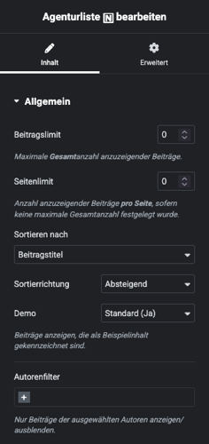

# Agentur-Listen

Die Listendarstellung von Beiträgen des Typs **Agentur** (CPT *inx_agency*) ist für Internet-Angebote relevant, die Inhalte und Angebote mehrerer Maklerbüros enthalten, dazu gehören bspw. klassische Immobilienportale oder Kooperations-Websites. Sie findet sowohl in den Archivseiten als auch in beliebigen anderen Seiten oder Inhaltselementen (per Shortcode) Verwendung.

## Archiv

Die Standard-Archivseiten der Agenturbeiträge sind unter `https://[DOMAIN.TLD]/immobilienmakler-agenturen/`1 bzw. `.../real-estate-agencies/`1 abrufbar, sofern diese nicht in den [Plugin-Optionen](../schnellstart/einrichtung?id=agentur-archiv) deaktiviert wurden und im WP-Backend unter ***Einstellungen → Permalinks*** die Option *Beitragsname* o. vgl. für die Permalink-Struktur festgelegt wurde.

So sieht die Agentur-Archivseite im Website-Frontend mit dem im Plugin enthaltenen Standard-Skin *TeamQuiwi* und dem WordPress-Theme *Twenty Twenty* **ohne individuelle Anpassungen** aus:

Der **Seiten- und Dokumenttitel** der Archivseiten kann in den Plugin-Optionen (***immonex → Einstellungen → Team ADD-ON***: *Agentur-Archiv-Titel*) festgelegt werden.

## Shortcode

`[inx-team-agency-list]`

Der Shortcode für die Einbindung der Agentur-Listen unterstützt alle [allgemeinen Attribute](../schnellstart/listen-attribute#Shortcodes) zur Filterung, Sortierung und Begrenzung der anzuzeigenden Elemente. Im Vergleich zur Archivseite gibt es hier eine Besonderheit:

Im Gegensatz zur *Archivseite* ist bei der Shortcode-basierten Listenvariante **keine Seitennavigation** verfügbar. Stattdessen wird ggf. ein Link zur Archivseite angezeigt, sofern die Anzahl der **pro Seite** anzuzeigenden Agentureinträge per [Attribut](/schnellstart/listen-attribute?id=shortcodes) `limit-page` begrenzt wird **und** das Agenturen-Archiv in den [Plugin-Optionen](/schnellstart/einrichtung?id=archiv3) nicht deaktiviert wurde. Beispiel:

`[inx-team-agency-list limit-page=8]`

## Elementor

Wurde die Website auf Basis von [Elementor](https://de.wordpress.org/plugins/elementor/) umgesetzt, kann das Listenelement auch per [Elementor-Widget](https://docs.immonex.de/kickstart-for-elementor/#/elementor-immobilien-widgets/agenturliste) eingebunden und konfiguriert werden.

Voraussetzung hierfür ist die Installation des kostenfreien [Kickstart-Elementor-Add-ons](https://immonex.dev/wordpress-immobilien-plugin/immonex-kickstart-for-elementor).

## Erweiterte Anpassungen

- [Templates (Skin)](/anpassung-erweiterung/standard-skin?id=archiv-amp-listenansicht)
- [Filter-Hooks](/anpassung-erweiterung/filters-actions?id=agenturen)
- [Action-Hooks](/anpassung-erweiterung/filters-actions?id=actions)

---

1 abhängig von der aktuellen Website-Sprache (→ [Übersetzungen & Mehrsprachigkeit](../anpassung-erweiterung/uebersetzung-mehrsprachigkeit))