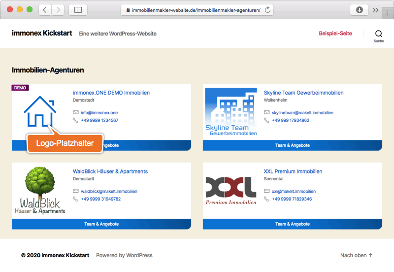

# Agentur-Listen

Die Listendarstellung von Beiträgen des Typs **Agentur** (CPT *inx_agency*) ist für Internet-Angebote relevant, die Inhalte und Angebote mehrerer Maklerbüros enthalten, dazu gehören bspw. klassische Immobilienportale oder Kooperations-Websites. Sie findet sowohl in den Archivseiten als auch in beliebigen anderen Seiten oder Inhaltselementen (per Shortcode) Verwendung.

## Archiv

Die Standard-Archivseiten der Agenturbeiträge sind unter `https://[DOMAIN.TLD]/immobilienmakler-agenturen/`1 bzw. `.../real-estate-agencies/`1 abrufbar, sofern diese nicht in den [Plugin-Optionen](../schnellstart/einrichtung?id=agentur-archiv) deaktiviert wurden und im WP-Backend unter ***Einstellungen → Permalinks*** die Option *Beitragsname* o. vgl. für die Permalink-Struktur festgelegt wurde.

So sieht die Agentur-Archivseite im Website-Frontend mit dem im Plugin enthaltenen Standard-Skin *TeamQuiwi* und dem WordPress-Theme *Twenty Twenty* **ohne individuelle Anpassungen** aus:

Der **Seiten- und Dokumenttitel** der Archivseiten kann in den Plugin-Optionen (***immonex → Einstellungen → Team [Add-on]: Agentur-Archiv-Titel***) festgelegt werden.

## Shortcode

`[inx-team-agency-list]`

Der Shortcode für die Einbindung der Agentur-Listen unterstützt alle [allgemeinen Attribute](../schnellstart/listen-attribute#Shortcodes) zur Filterung, Sortierung und Begrenzung der anzuzeigenden Elemente.

---

1 abhängig von der aktuellen Website-Sprache (→ [Übersetzungen & Mehrsprachigkeit](../anpassung-erweiterung/uebersetzung-mehrsprachigkeit))