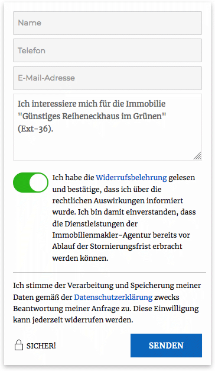
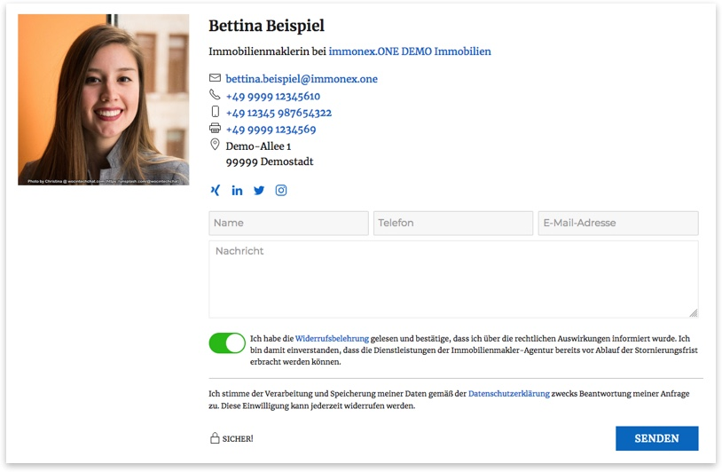

# Kontaktformular

Das Add-on bringt ein **einheitliches** Kontaktformular mit, das in den Detailansichten und Widgets der [Agenturen](agentur-details.html) und [Kontaktpersonen](kontaktpersonen-details.html) verwendet werden kann.

## Widget

Wird das Formular für ein Widget aktiviert, das bspw. in einem Sidebar-Bereich der Immobilien-Detailseiten eingebunden ist, wird automatisch der entsprechende Objekttitel im Nachrichtenfeld übernommen. Dieser ist – neben der ID, Objektnummer, URL sowie einem **OpenImmo-Feedback-Anhang** für die weitere (automatisierte) Verarbeitung – nach dem Absenden auch in den Anfragemails enthalten.

## Detailansicht

Hier ein Beispiel der Formulareinbindung in einer [Kontaktpersonen-Detailseite](kontaktpersonen-details.html):

