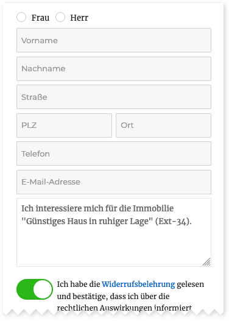

# Kontaktformular

Das Add-on bringt ein **einheitliches** Kontaktformular mit, das in den Detailansichten und Widgets der [Agenturen](agentur-details.html) und [Kontaktpersonen](kontaktpersonen-details.html) verwendet werden kann.

Die Grundeinstellungen bezüglich Formularumfang und Mailversand werden in den [Plugin-Optionen](../schnellstart/einrichtung.html#Kontaktformular) vorgenommen. Bei immobilienbezogenen Anfragen werden Mailanhänge im **OpenImmo-Feedback-XML-Format** unterstützt, mit denen bspw. eine automatisierte Verarbeitung der Daten in einer externen Immobilienmakler-Softwarelösung realisiert werden kann.

## Widget

Wird das Formular in einem Widget aktiviert, das bspw. in einem Sidebar-Bereich der Immobilien-Detailseiten eingebunden ist, wird automatisch der entsprechende Objekttitel im Nachrichtenfeld übernommen. Dieser ist – neben der ID, Objektnummer, URL sowie einem optionalen **OpenImmo-Feedback-Anhang** für die weitere (automatisierte) Verarbeitung – nach dem Absenden auch in den Anfragemails enthalten.

Per Widget-Einstellung (<i>Kontaktformular-Umfang</i>) kann eine erweiterte Variante des Kontaktformulars mit zusätzlichen Pflichtfeldern aktiviert werden, sofern diese nicht ohnehin schon in den [Plugin-Optionen](../schnellstart/einrichtung.html#Erweitertes-Formular) voreingestellt wurde. (Bei Widgets, die via Shortcode eingebunden werden, kann hierfür das Attribut `contact_form_scope` mit dem Wert *extended* verwendet werden.)

## Detailansicht

Hier ein Beispiel der Formulareinbindung in einer [Kontaktpersonen-Detailseite](kontaktpersonen-details.html):

Auch hier gilt: Eine **erweiterte Formular-Variante** kann in den [Plugin-Optionen](../schnellstart/einrichtung.html#Erweitertes-Formular) aktiviert werden. Zudem besteht die Möglichkeit (in Sonderfällen) zusätzliche, **benutzerdefinierte** Formularelemente über den Filter-Hook [`inx_team_contact_form_fields`](../anpassung-erweiterung/filter-inx-team-contact-form-fields.html) zu ergänzen oder vorhandene Elemente individuell anzupassen.