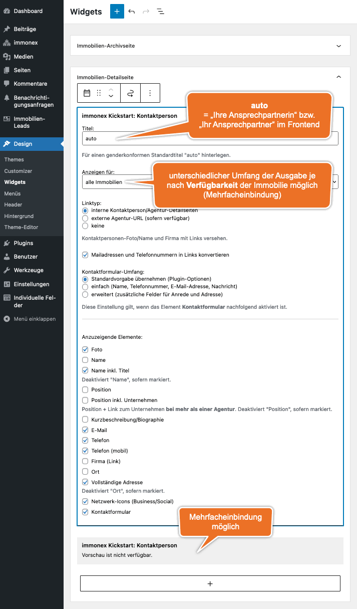

# Kontaktpersonen-Details

Auch bei den Kontaktpersonen werden grundsätzlich zwei Arten der Ausgabe unterschieden: Der Umfang des **Standard-Templates** (**Vollansicht**) umfasst beim <i>TeamQuiwi-Skin</i> neben dem Namen und Foto (sofern vorhanden) der Person alle relevanten Kontaktdaten sowie einen zusätzlichen Abschnitt für die Immobilienangebote, die dem Ansprechpartner respektive der Ansprechpartnerin zugeordnet sind.

Das **Widget-Template** bietet die bereits bekannte kompaktere Form der Daten, die für die Darstellung als Teil einer Immobilien-Detailansicht optimiert ist.

## Vollansicht

Die Standard-Einzelansicht (<i>Single Template</i>, d. h. vollständige Seite inkl. Header und Footer der Website) enthält eine Vollansicht der Daten einer Kontaktperson. Das URL-Schema dieser Seiten sieht im Regelfall so aus:

`https://[WEBSITE.TLD]/immobilienmakler/[NAMENS-SLUG]/`1 bzw. `https://[WEBSITE.TLD]/real-estate-agents/[NAMENS-SLUG]/`1

Hier ein Beispiel – wie immer mit <i>TeamQuiwi-Skin</i> und dem WP-Standard-Theme <i>Twenty Twenty</i>:

> Die im Screenshot enthaltene Seitennavigation bezieht sich auf die Liste der Immobilien-Angebote.

## Widget

`immonex Kickstart: Kontaktperson`

Wie das [Agentur-Widget](agentur-details.html#Widget) ist auch die Variante für Kontaktpersonen in erster Linie für den Einsatz im Sidebar-Bereich der Immobilien-Detailseiten vorgesehen. (Die Kontaktperson, deren Daten angezeigt werden sollen, wird automatisch anhand der **primären Kontaktpersonen-ID** ermittelt, die der betr. [Immobilie zugewiesen](../beitragsarten.html#Kontaktperson-Agentur-gt-Immobilie) ist.)

Ein Frontend-Beispiel auf Basis des WP-Standard-Themes <i>Twenty Sixteen</i>:

**Alternativ** hierzu wird die Widget-Ansicht (hier im <i>Twenty Twenty</i> Theme-Look) auch als Ersatz des [Standard-Kontaktdaten-Abschnitts](../schnellstart/einrichtung.html#Anpassung-des-Standard-Kontaktabschnitts) in den Objekt-Details verwendet, sofern die entsprechende [Add-on-Option](../schnellstart/einrichtung.html#Anpassung-des-Standard-Kontaktabschnitts) ausgewählt ist (Standardeinstellung nach der ersten Plugin-Aktivierung):

> Wird das Widget in einem Sidebar-Bereich verwendet, sollte der [Standard-Kontaktdaten-Abschnitt](../schnellstart/einrichtung.html#Anpassung-des-Standard-Kontaktabschnitts) über die entsprechende Plugin-Option **ausbeblendet** werden.

Das Widget kann via ***Design → Widgets*** oder (bei geöffneter Immobilien-Detailseite) ***Customizer → Widgets*** eingebunden und konfiguriert werden:

## Shortcode

`[inx-team-agent]`

Mit diesem Shortcode kann sowohl die Vollansicht als auch das Widget in beliebige Seiten oder sonstige Inhaltselemente (z. B. Page-Builder-Content-Blöcke) eingefügt werden.

#### Attribute

Alle folgenden Attribute sind **optional**.

| Name | Beschreibung / Attributwerte |
| ---- | ---------------------------- |
| `id` | ID des Kontaktpersonen-Beitrags (nur notwendig, sofern die Einbindung **nicht** als Teil eines Immobilien-Beitrags erfolgt und somit keine automatische Bestimmung möglich ist) |
| `type` | Darstellungsart - wird nur bei Einbindung als Widget benötigt (Wert ergo *widget*), Standard ist die Vollansicht |
| `title` | nur Widget: Titel/Überschrift (*auto* = "genderkonform", z. B. "Meine Ansprechpartnerin"1 bzw. "Mein Ansprechpartner"1) |
| `before_title` | nur Widget: HTML-Code vor dem Titel (WP/Theme-Vorgabe überschreiben) |
| `after_title` | nur Widget: HTML-Code nach dem Titel (WP/Theme-Vorgabe überschreiben) |
| `convert_links` | *1* oder *yes*, um Mailadressen und Telefonnummern bei der Ausgabe in Links zu konvertieren |
| `elements` | kommagetrennte Liste der anzuzeigenden Elemente: |
| | *photo*: Foto der Kontaktperson (in der Vollansicht immer enthalten) |
| | *full_name*: Vor- und Nachname |
| | *full_name_incl_title*: Vor- und Nachname inkl. Titel |
| | *position*: Position/Funktion im Unternehmen oder Berufsbezeichnung |
| | *position_incl_company*: Position/Funktion/Berufsbezeichnung + Firma |
| | *bio*: Kurzbeschreibung/-biographie der Person |
| | *email_auto_select*: **primäre** Mailadresse (automatische Ermittlung) |
| | *phone_auto_select*: **primäre** Telefonnummer (automatische Ermittlung) |
| | *phone_mobile*: Telefonnummer mobil |
| | *company_link*: Firma (verlinkt) |
| | *city*: Ort (Bürostandort) |
| | *address*: Adresse (Bürostandort) |
| | *network_icons*: Icons/Links von Business- und sozialen Netzwerken, für die eine URL im Kontaktpersonen-Datensatz hinterlegt ist) |
| | *contact_form*: einheitliches Kontaktformular |
| `link_type` | nur Widget – Art der Verlinkung von Foto, Name und Firma: |
| | *internal*: Link zur **internen** [Kontaktpersonen-Profilseite](#Vollansicht) (Foto/Name) bzw. [Agentur-Detailseite](agentur-details.html#Vollansicht) (Firma) |
| | *external*: Link zu einer externen Website, sofern eine entsprechende URL  vorhanden ist |
| | *none*: keine Verlinkung |

#### Beispiele

Vollansicht mit automatisch konvertierten E-Mail/Telefon-Links
`[inx-team-agent convert_links=1]`

Widget mit Foto, Name inkl. Titel, Position, primärer Mailadresse und Telefonnummer (als Link) sowie interner Verlinkung (Foto/Name/Firma)
`[inx-team-agent type="widget" elements="photo, full_name_incl_title, position, email_auto_select, phone_auto_select, contact_form" convert_links=1 link_type="internal"]`

---

1 abhängig von der aktuellen Website-Sprache (→ [Übersetzungen & Mehrsprachigkeit](../anpassung-erweiterung/uebersetzung-mehrsprachigkeit.html))