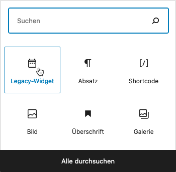

# Kontaktpersonen-Details

Auch bei den Kontaktpersonen werden grundsätzlich zwei Arten der Ausgabe unterschieden: Der Umfang des **Standard-Templates** (**Vollansicht**) umfasst beim *TeamQuiwi-Skin* neben dem Namen und Foto (sofern vorhanden) der Person alle relevanten Kontaktdaten sowie einen zusätzlichen Abschnitt für die Immobilienangebote, die dem Ansprechpartner respektive der Ansprechpartnerin zugeordnet sind.

Das **Widget-Template** bietet die bereits bekannte kompaktere Form der Daten, die für die Darstellung als Teil einer Immobilien-Detailansicht optimiert ist.

## Vollansicht

Die Standard-Einzelansicht (*Single Template*, d. h. vollständige Seite inkl. Header und Footer der Website) enthält eine Vollansicht der Daten einer Kontaktperson. Das URL-Schema dieser Seiten sieht im Regelfall so aus:

`https://[WEBSITE.TLD]/immobilienmakler/[NAMENS-SLUG]/`1 bzw. `https://[WEBSITE.TLD]/real-estate-agents/[NAMENS-SLUG]/`1

Voraussetzung für die Verfügbarkeit dieser Seiten ist, dass sie in den [Plugin-Optionen](../einrichtung?id=kontaktpersonen-archiveinzelansicht) nicht deaktiviert wurden und im WP-Backend unter ***Einstellungen → Permalinks*** die Option *Beitragsname* o. vgl. für die Permalink-Struktur festgelegt wurde

Hier ein Beispiel – wie immer mit *TeamQuiwi-Skin* und dem WP-Standard-Theme *Twenty Twenty*:

?> Die im Screenshot enthaltene Seitennavigation bezieht sich auf die Liste der Immobilien-Angebote.

### Optionale Abschnitte

Die Liste der Immobilien-Angebote und die *Footer-Box* mit Logo, Kurzbeschreibung und Link zur Detailseite der zugehörigen Agentur (sofern vorhanden und aktiviert) sind optional und können in der **Vollansicht** auch ausgeblendet werden – entweder individuell pro Kontaktperson im jeweiligen Backend-Bearbeitungsformular unter ***immonex → Kontaktpersonen*** in der Optionsbox *Sonstiges* oder per Übernahme der Standardvorgabe in den [Plugin-Optionen](../schnellstart/einrichtung?id=optionale-abschnitte-1) (***immonex → Einstellungen → Team ADD-ON → Kontaktpersonen***: *Optionale Abschnitte*).

Bei einer Einbindung per [Shortcode](#shortcode) kann die (explizite) Ein- oder Ausblendung auch mittels Attributen erfolgen (`show_property_list`/`show_agency_link`).

## Widget

`immonex Kickstart: Kontaktperson`

Wie das [Agentur-Widget](agentur-details#Widget) ist auch die Variante für Kontaktpersonen in erster Linie für den Einsatz im Sidebar-Bereich der Immobilien-Detailseiten vorgesehen. (Die Kontaktperson, deren Daten angezeigt werden sollen, wird automatisch anhand der **primären Kontaktpersonen-ID** ermittelt, die der betr. [Immobilie zugewiesen](../beitragsarten#kontaktpersonagentur-→-immobilie) ist.)

?> Das im Widget enthaltene Kontaktformular umfasst in der Standardvariante Eingabefelder für Name, Telefonnummer, Mailadresse sowie für die Nachricht, kann per Plugin-Option, Widget-Einstellung, Shortcode-Attribut oder Filterfunktion aber auch um zusätzliche Felder/Optionen für Anrede und Adresse der Interessenten erweitert werden.

Ein Frontend-Beispiel auf Basis des WP-Standard-Themes *Twenty Sixteen*:

**Alternativ** hierzu wird die Widget-Ansicht (hier im *Twenty Twenty* Theme-Look) auch als Ersatz des [Standard-Kontaktdaten-Abschnitts](../schnellstart/einrichtung#Anpassung-des-Standard-Kontaktabschnitts) in den Objekt-Details verwendet, sofern die entsprechende [Add-on-Option](../schnellstart/einrichtung#Anpassung-des-Standard-Kontaktabschnitts) ausgewählt ist (Standardeinstellung nach der ersten Plugin-Aktivierung):

!> Wird das Widget in einem Sidebar-Bereich verwendet, sollte der [Standard-Kontaktdaten-Abschnitt](../schnellstart/einrichtung#Anpassung-des-Standard-Kontaktabschnitts) über die entsprechende Plugin-Option **ausgeblendet** werden.

Das Widget kann via ***Design → Widgets*** (ab WordPress 5.8 als Block des Typs *Legacy-Widget*) oder – bei geöffneter Immobilien-Detailseite – ***Customizer → Widgets*** eingebunden und konfiguriert werden:

Auch eine **mehrfache Einbindung** des Widgets ist möglich, bspw. wenn der Umfang der Ausgabe sich bei Referenzobjekten von dem regulärer Objekte unterscheiden soll. Die entsprechende Auswahl des Objektstatus erfolgt in diesem Fall über die Widget-Option *Anzeigen für* (beim folgenden Shortcode analog mit dem Attribut `display_for`).

## Shortcode

`[inx-team-agent]`

Mit diesem Shortcode kann sowohl die Vollansicht als auch das Widget in beliebige Seiten oder sonstige Inhaltselemente (z. B. Page-Builder-Content-Blöcke) eingefügt werden.

#### Attribute

Alle folgenden Attribute sind **optional**.

| Name | Beschreibung / Attributwerte |
| ---- | ---------------------------- |
| `id` | ID des Kontaktpersonen-Beitrags (nur notwendig, sofern die Einbindung **nicht** als Teil eines Immobilien-Beitrags erfolgt und somit keine automatische Bestimmung möglich ist) |
| `type` | Darstellungsart - wird nur bei Einbindung als Widget benötigt (Wert ergo *widget*), Standard ist die Vollansicht |
| `title` | nur Widget: Titel/Überschrift (*auto* = "genderkonform", z. B. "Meine Ansprechpartnerin"1 bzw. "Mein Ansprechpartner"1) |
| `before_title` | nur Widget: HTML-Code vor dem Titel (WP/Theme-Vorgabe überschreiben) |
| `after_title` | nur Widget: HTML-Code nach dem Titel (WP/Theme-Vorgabe überschreiben) |
| `convert_links` | *1* oder *yes*, um Mailadressen und Telefonnummern bei der Ausgabe in Links zu konvertieren |
| `elements` | kommagetrennte Liste der anzuzeigenden Elemente: |
| | *photo* → Foto der Kontaktperson (in der Vollansicht immer enthalten) |
| | *full_name* → Vor- und Nachname |
| | *full_name_incl_title* → Vor- und Nachname inkl. Titel |
| | *position* → Position/Funktion im Unternehmen oder Berufsbezeichnung |
| | *position_incl_company* → Position/Funktion/Berufsbezeichnung + Firma |
| | *bio* → Kurzbeschreibung/-biographie der Person |
| | *email_auto_select* → **primäre** Mailadresse (automatische Ermittlung) |
| | *phone_auto_select* → **primäre** Telefonnummer (automatische Ermittlung) |
| | *phone_mobile* → Telefonnummer mobil |
| | *company_link* → Firma (verlinkt) |
| | *city* → Ort (Bürostandort) |
| | *address* → Adresse (Bürostandort) |
| | *network_icons* → Icons/Links von Business- und sozialen Netzwerken, für die eine URL im Kontaktpersonen-Datensatz hinterlegt ist) |
| | *contact_form* → einheitliches [Kontaktformular](kontaktformular) (siehe auch `contact_form_scope` unten) |
| `link_type` | nur Widget – Art der Verlinkung von Foto, Name und Firma: |
| | *internal* → Link zur **internen** [Kontaktpersonen-Profilseite](#Vollansicht) (Foto/Name) bzw. [Agentur-Detailseite](agentur-details#Vollansicht) (Firma) |
| | *external* → Link zu einer externen Website, sofern eine entsprechende URL  vorhanden ist |
| | *none* → keine Verlinkung |
| `display_for` | nur Widget – Anzeige nur bei Immobilien mit einem bestimmten Status: |
| | *all* → alle Objekte |
| | *all_except_references* → alle Immobilien **außer** Referenzobjekte |
| | *available_only* → nur verfügbare Objekte |
| | *unavailable_only* → nur **nicht** verfügbare Objekte |
| | *references_only* → nur Referenzobjekte |
| `contact_form_scope` | Feldumfang des [Kontaktformulars](kontaktformular): |
| | *basic* → Name, Telefonnummer, E-Mail-Adresse und Nachricht (Standardvorgabe) |
| | *extended* → **zusätzliche** Pflichtfelder/-auswahloptionen für Anrede und Adresse, separate Felder für Vor- und Nachname |
| `show_property_list` | nur Vollansicht: Liste der zugehörigen Immobilien explizit ein- oder aublenden (entsprechende Angabe in den Add-on-Optionen ([Optionale Abschnitte](#optionale-abschnitte)) und dem [Kontaktpersonen-Datensatz](/beitragsarten?id=verarbeitungspezial-flags-etc) überschreiben) |
| | *1* oder *yes* : anzeigen |
| | *0* oder *no* : nicht anzeigen |
| `show_agency_link` | nur Vollansicht: *Footer-Box* mit Logo (sofern vorhanden), Kurzbeschreibung und Link zur Agentur-Detailseite explizit ein- oder aublenden (entsprechende Angabe in den Add-on-Optionen ([Optionale Abschnitte](#optionale-abschnitte)) und dem [Kontaktpersonen-Datensatz](/beitragsarten?id=verarbeitungspezial-flags-etc) überschreiben) |
| | *1* oder *yes* : anzeigen |
| | *0* oder *no* : nicht anzeigen |

#### Beispiele

Vollansicht mit automatisch konvertierten E-Mail/Telefon-Links
`[inx-team-agent convert_links=1]`

Widget mit Foto, Name inkl. Titel, Position, primärer Mailadresse und Telefonnummer (als Link) sowie interner Verlinkung (Foto/Name/Firma)
`[inx-team-agent type="widget" elements="photo, full_name_incl_title, position, email_auto_select, phone_auto_select, contact_form" convert_links=1 link_type="internal"]`

Widget (Standardansicht), keine Anzeige bei Referenzobjekten
`[inx-team-agent type="widget" display_for="all_except_references"]`

Widget mit Standardumfang, aber erweitertem Kontaktformular (u. a. inkl. Adressfeldern):
`[inx-team-agent type="widget" contact_form_scope="extended"]`

## Erweiterte Anpassungen

- [Templates (Skin)](/anpassung-erweiterung/standard-skin?id=detailansichten)
- [Filter-Hooks](/anpassung-erweiterung/filters-actions?id=kontaktpersonen)
- [Action-Hooks](/anpassung-erweiterung/filters-actions?id=actions)

---

1 abhängig von der aktuellen Website-Sprache (→ [Übersetzungen & Mehrsprachigkeit](../anpassung-erweiterung/uebersetzung-mehrsprachigkeit))