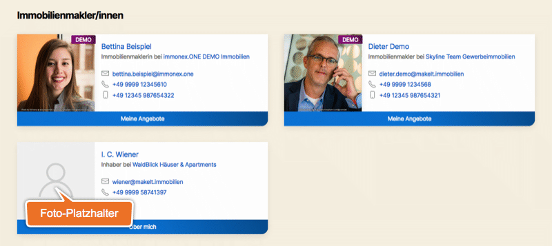

# Kontaktpersonen-Listen

Auch die Listendarstellung von Beiträgen des Typs **Kontaktperson** (CPT *inx_agent*) kommt sowohl in den zugehörigen Archivseiten als auch in beliebigen anderen Seiten oder Inhaltselementen (per Shortcode) zum Einsatz.

## Archivseite

Die Standard-Archivseiten der Kontaktpersonen-Beiträge sind unter `https://[DOMAIN.TLD]/immobilienmakler/`1 bzw. `.../real-estate-agent/`1 abrufbar, sofern diese nicht in den [Plugin-Optionen](../schnellstart/einrichtung?id=kontaktpersonen-archiveinzelansicht) deaktiviert wurden und im WP-Backend unter ***Einstellungen → Permalinks*** die Option *Beitragsname* o. vgl. für die Permalink-Struktur festgelegt wurde.

Die Optik im Website-Frontend entspricht dabei weitestgehend der der [Agentur-Listen](index):

Der **Seiten- und Dokumenttitel** der Archivseite kann in den Plugin-Optionen (***immonex → Einstellungen → Team ADD-ON***: *Kontaktpersonen-Archiv-Titel*) festgelegt werden.

## Shortcode

`[inx-team-agent-list]`

Der Shortcode für die Einbindung der Kontaktpersonen-Listen unterstützt alle [allgemeinen Attribute](../schnellstart/listen-attribute#Shortcodes) zur Filterung, Sortierung und Begrenzung der anzuzeigenden Elemente.

---

1 abhängig von der aktuellen Website-Sprache (→ [Übersetzungen & Mehrsprachigkeit](../anpassung-erweiterung/uebersetzung-mehrsprachigkeit))