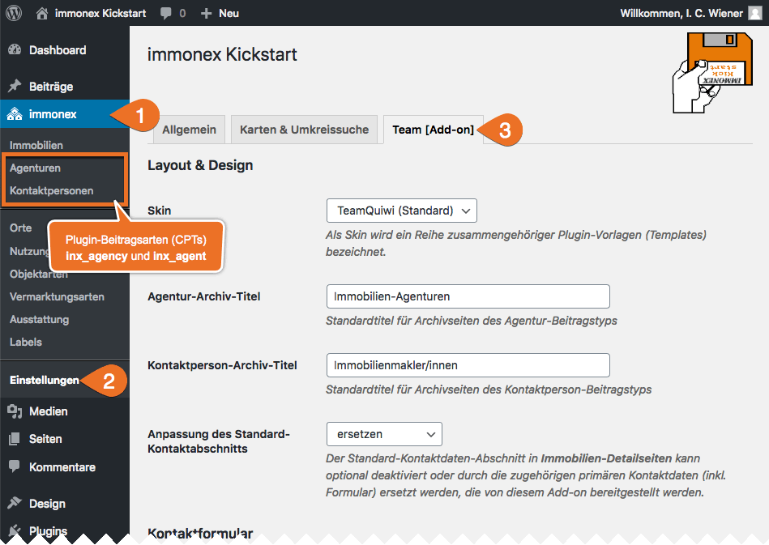
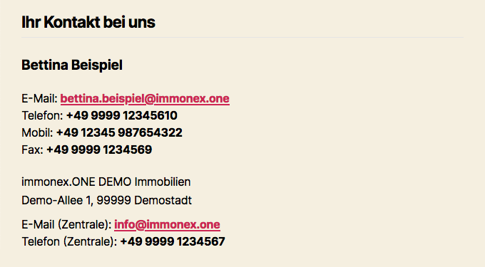

# Einrichtung

Bei aktiviertem [Kickstart-Plugin](https://de.wordpress.org/plugins/immonex-kickstart/) sind die zugehörigen Inhalte und Optionen in der Hauptnavigation des WordPress-Admin-Backends unter ***immonex*** zusammengefasst.

Die Einstellungen des Team-Add-ons sind im gleichnamigen Tab enthalten: ***immonex → Einstellungen → Team [Add-on]***

## Add-on-Optionen

Die meisten Optionen sind selbsterklärend oder mit einer Beschreibung versehen. Hier einige ergänzende Details zu zentralen Einstellungsmöglichkeiten:

### Layout & Design

#### Skin

Ein so genanntes [Skin](../anpassung-erweiterung/skins.html) bildet die Grundlage für individuelle Anpassungen und umfasst alle Dateien, die für die **Ausgabe und Darstellung** der vom Plugin bereitgestellten Komponenten im **Website-Frontend** maßgeblich sind (Layoutvorlagen, Stile, Ausgabelogik etc.).

Kurzum: Mit einem alternativen Skin können Optik und Umfang der angezeigten Daten sowie die Benutzer-Interaktion grundlegend verändert und – bei Bedarf bis ins Detail – an die spezifischen Vorgaben des jeweiligen Projekts angepasst werden.

Das aktuell mitgelieferte [Skin "TeamQuiwi"](../anpassung-erweiterung/standard-skin.html) orientiert sich optisch am Standard-Skin "Quiwi" des Kickstart-Basisplugins und setzt wie dieses ebenfalls auf Komponenten des Frontend-Frameworks [UIkit](https://getuikit.com/).

Detaillierte Infos zur Anpassung vorhandener und Entwicklung eigener Skins sind unter [Anpassung & Erweiterung](../anpassung-erweiterung/skins.html) zu finden.

#### Anpassung des Standard-Kontaktabschnitts

Auch ohne Team-Add-on werden natürlich **objektbezogene Kontaktdaten** in den Detailseiten der Immobilien-Angebote angezeigt, sofern das Kickstart-Standard-Skin "Quiwi" im Einsatz ist. Der entsprechende Abschnitt sieht in diesem Fall – oder wenn als Wert dieser Option `keine Änderung` ausgewählt ist – folgendermaßen aus (WP-Theme <i>Twenty Twenty</i>):

**Mit Team-Add-on** und der Auswahl von `ersetzen` (Standardvorgabe) ist die Sache aber deutlich schicker und funktionaler:

Werden die Kontaktdaten an einer anderen Position per Widget ([Ansprechpartner/in](../komponenten/kontaktpersonen-details.html#Widget) und/oder [Agentur](../komponenten/agentur-details.html#Widget)) eingebunden, kann – und sollte – der Standard-Abschnitt ausgeblendet werden (`ausblenden`).

### Kontaktformular

#### Fallback-Empfänger-Mailadressen

Die Empfänger der Mails, die über das im Plugin enthaltene [einheitliche Kontaktformular](../komponenten/kontaktformular.html) versendet werden, sind **kontextbezogen**: Findet das Formular bspw. in einem [Kontaktpersonen-Widget](../komponenten/kontaktpersonen-details.html#Widget) Verwendung, das in einer Objekt-Detailseite eingebunden ist, wird die Nachricht an die Mailadresse der zugehörigen [primären Kontaktperson](../beitragsarten.html#Kontaktperson-Agentur-gt-Immobilie) gesendet. Sind der Immobilie weitere Ansprechpartner/innen zugeordnet, erhalten diese jeweils eine Kopie der Anfrage.

Kann in Ausnahmefällen keine dem Kontext entsprechende Empfänger-Mailadresse ermittelt werden, wird als Standardvorgabe die primäre Administrator-E-Mail-Adresse der WP-Installation übernommen, die unter ***Einstellungen → Allgemein*** hinterlegt ist. Sollen die Mails stattdessen an eine oder mehrere alternative Adressen gesendet werden, können diese im Feld für Fallback-Empfänger angegeben oder per [Filterfunktion](../anpassung-erweiterung/filter-inx-team-fallback-recipient-admin-email.html) definiert werden.

#### CC-Mailadressen

Sollen Kopien **aller** via [Kontaktformular](../komponenten/kontaktformular.html) versendeten Anfragen an eine oder mehrere Mailadressen gesendet werden, können diese hier definiert werden.

#### Seite der Widerrufsbelehrung

Eine hier ausgewählte Seite, die Informationen zum gesetzlichen Widerrufsrecht enthält, ist Voraussetzung für die Einbindung des nachfolgenden **Einwilligungstexts** in das [Kontaktformular](../komponenten/kontaktformular.html). (Im Rahmen der Plugin-Installation erfolgt eine automatische Zuordnung, sofern eine passende Seite erkannt wurde.)

#### Einwilligungstext zum Widerrufsrecht

Dieser Hinweis muss vom Benutzer bestätigt werden, bevor er seine Anfrage per Kontaktformular absenden kann. Mit `[cancellation_policy]` kann ein Link zur zuvor ausgewählten Seite eingefügt werden.

#### Einwilligungstext zum Datenschutz

Ein Hinweis zum Thema Datenschutz ist obligatorisch, muss aber **nicht** explizit bestätigt werden. Per Platzhalter `[privacy_policy]` wird ein Link zur entsprechenden Infoseite (**Datenschutzerklärung**) eingefügt, die unter ***Einstellungen → Datenschutz*** definiert wurde.

#### OpenImmo-Feedback-Typ

**OpenImmo-Feedback** bezeichnet einen Standard für den einheitlichen Austausch von Daten immobilienspezifischer Anfragen (Interessenten-Kontaktdaten und Infos zum angefragten Objekt) auf XML-Basis.

Beim Absenden von Kontaktformular-Daten wird ein solcher Datensatz (optional) automatisiert erstellt und kann entweder als Datei oder direkt im Nachrichtentext an die Mails angehangen werden, die an den Website-Betreiber bzw. Administrator gesendet werden. Anhänge dieser Art können bspw. in einer Softwarelösung für Immobilienmakler weiterverarbeitet werden.