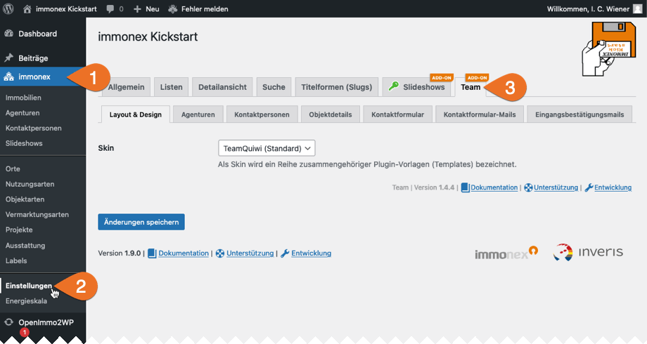

# Einrichtung

Bei aktiviertem [Kickstart-Plugin](https://de.wordpress.org/plugins/immonex-kickstart/) sind die zugehörigen Inhalte und Optionen in der Hauptnavigation des WordPress-Admin-Backends unter ***immonex*** zusammengefasst.

Die Einstellungen des Team-Add-ons sind im gleichnamigen Tab enthalten: ***immonex → Einstellungen → Team [Add-on]***

## Add-on-Optionen

Die meisten Optionen sind selbsterklärend oder mit einer Beschreibung versehen. Hier einige ergänzende Details zu zentralen Einstellungsmöglichkeiten:

### Layout & Design

#### Skin

Ein so genanntes [Skin](../anpassung-erweiterung/skins) bildet die Grundlage für individuelle Anpassungen und umfasst alle Dateien, die für die **Ausgabe und Darstellung** der vom Plugin bereitgestellten Komponenten im **Website-Frontend** maßgeblich sind (Layoutvorlagen, Stile, Ausgabelogik etc.).

Kurzum: Mit einem alternativen Skin können Optik und Umfang der angezeigten Daten sowie die Benutzer-Interaktion grundlegend verändert und – bei Bedarf bis ins Detail – an die spezifischen Vorgaben des jeweiligen Projekts angepasst werden.

Das aktuell mitgelieferte [Skin "TeamQuiwi"](../anpassung-erweiterung/standard-skin) orientiert sich optisch am Standard-Skin "Quiwi" des Kickstart-Basis-Plugins und setzt wie dieses ebenfalls auf Komponenten des Frontend-Frameworks [UIkit](https://getuikit.com/).

Detaillierte Infos zur Anpassung vorhandener und Entwicklung eigener Skins sind unter [Anpassung & Erweiterung](../anpassung-erweiterung/skins) zu finden.

#### Anpassung des Standard-Kontaktabschnitts

Auch ohne Team-Add-on werden natürlich **objektbezogene Kontaktdaten** in den Detailseiten der Immobilien-Angebote angezeigt, sofern das Kickstart-Standard-Skin "Quiwi" im Einsatz ist. Der entsprechende Abschnitt sieht in diesem Fall – oder wenn als Wert dieser Option `keine Änderung` ausgewählt ist – folgendermaßen aus (WP-Theme *Twenty Twenty*):

**Mit Team-Add-on** und der Auswahl von `ersetzen` (Standardvorgabe) ist die Sache aber deutlich schicker und funktionaler:

Die "genderkonformen Titel", die für die Überschrift des Kontaktabschnitts verwendet werden, sind in den Übersetzungsdateien hinterlegt und können bei Bedarf auch [hier geändert](../anpassung-erweiterung/uebersetzung-mehrsprachigkeit) werden. Im folgenden Eingabefeld (*Standard-Überschrift des Kontaktabschnitts*) kann aber auch ein **alternativer** Text hierfür hinterlegt werden. (Ist das Feld leer, wird die Titelzeile entsprechend ausgeblendet. Mit "auto" wird wiederum die o. g. Standard-Variante übernommen.)

Werden die Kontaktdaten an einer anderen Position per Widget ([Ansprechpartner/in](../komponenten/kontaktpersonen-details#Widget) und/oder [Agentur](../komponenten/agentur-details#Widget)) eingebunden, kann – und sollte – der Standard-Abschnitt ausgeblendet werden (`ausblenden`).

### Kontaktformular

#### Erweitertes Formular

Das Kontaktformular umfasst in der Standardvariante Eingabefelder für Name, Telefonnummer, Mailadresse sowie für die Nachricht. Ist diese Option aktiviert, werden eine Auswahlmöglichkeit für die Anrede, separate Felder für Vor- und Nachname sowie zusätzliche **Pflichtfelder** für die Adresse des Absenders ergänzt.

Je nach Art der Einbindung kann diese Vorgabe per Widget-Einstellung (*Kontaktformular-Umfang*) oder Shortcode-Attribut (`contact_form_scope`) überschrieben werden. Darüber hinaus können Umfang und Art der Formularelemente auch über den Hook [`inx_team_contact_form_fields`](../anpassung-erweiterung/filter-inx-team-contact-form-fields) mit einer Filterfunktion individuell angepasst oder erweitert werden.

#### Seite der Widerrufsbelehrung

Eine hier ausgewählte Seite, die Informationen zum gesetzlichen Widerrufsrecht enthält, ist Voraussetzung für die Einbindung des nachfolgenden **Einwilligungstexts** in das [Kontaktformular](../komponenten/kontaktformular). (Im Rahmen der Plugin-Installation erfolgt eine automatische Zuordnung, sofern eine passende Seite erkannt wurde.)

#### Einwilligungstext zum Widerrufsrecht

Dieser Hinweis muss vom Benutzer bestätigt werden, bevor er seine Anfrage per Kontaktformular absenden kann. Mit `[cancellation_policy]` kann ein Link zur zuvor ausgewählten Seite eingefügt werden.

#### Datenschutzhinweis

Ein Hinweis zum Thema Datenschutz ist obligatorisch, muss aber **nicht** explizit bestätigt werden. Per Platzhalter `[privacy_policy]` wird ein Link zur entsprechenden Infoseite (**Datenschutzerklärung**) eingefügt, die unter ***Einstellungen → Datenschutz*** definiert wurde.

#### Bestätigungsmeldung

Sofern **keine** Weiterleitung zu einer Bestätigungsseite erfolgt (folgende Option), wird der hier hinterlegte Text bei erfolgreicher Übermittlung der Formulardaten angezeigt.

#### Eingangsbestätigungsseite ID/URL

Hier kann die ID einer lokalen Seite oder eine URL angegeben werden, zu der nach dem Absenden der Formulars weitergeleitet wird. In mehrsprachigen Umgebungen muss das Feld die ID der Seite in der primären Sprache enthalten.

Ist das Ziel eine Seite der WP-Installation, kann hier per Shortcode die o. g. Bestätigungsmeldung eingefügt werden:

`[inx-team-contact-form-confirmation-message]`

### Kontaktformular-Mails

Mit der Plugin-Version 1.2.0 wurden die mailbezogenen Optionen in zwei separaten Subtabs zusammengefasst. Ebenfalls neu hinzugekommen sind hier die Möglichkeiten zum Versand von **HTML-Mails**1 sowie die Gestaltung der Mailinhalte auf Basis der *Template-Engine* [Twig 3](https://twig.symfony.com/doc/3.x/templates)2.

#### Fallback-Empfänger-Mailadressen

Die Empfänger der Mails, die über das im Plugin enthaltene [einheitliche Kontaktformular](../komponenten/kontaktformular) versendet werden, sind **kontextbezogen**: Findet das Formular bspw. in einem [Kontaktpersonen-Widget](../komponenten/kontaktpersonen-details#Widget) Verwendung, das in einer Objekt-Detailseite eingebunden ist, wird die Nachricht an die Mailadresse der zugehörigen [primären Kontaktperson](../beitragsarten#kontaktpersonagentur-→-immobilie) gesendet. Sind der Immobilie weitere Ansprechpartner/innen zugeordnet, erhalten diese jeweils eine Kopie der Anfrage.

Kann in Ausnahmefällen keine dem Kontext entsprechende Empfänger-Mailadresse ermittelt werden, wird als Standardvorgabe die primäre Administrator-E-Mail-Adresse der WP-Installation übernommen, die unter ***Einstellungen → Allgemein*** hinterlegt ist. Sollen die Mails stattdessen an eine oder mehrere alternative Adressen gesendet werden, können diese im Feld für Fallback-Empfänger angegeben oder per [Filterfunktion](../anpassung-erweiterung/filter-inx-team-fallback-recipient-admin-email) definiert werden.

#### CC-Mailadressen

Sollen Kopien **aller** via [Kontaktformular](../komponenten/kontaktformular) versendeten Anfragen an eine oder mehrere Mailadressen gesendet werden, können diese hier definiert werden.

#### HTML-Mails senden

Anstelle von reinen Textmails (Standardvorgabe) können die per Kontaktformular übermittelten Daten auch als HTML-formatierte Nachrichten gesendet werden. (Eine alternative, automatisiert generierte Klartext-Version wird immer mitgesendet.)

#### Kontaktformular-Mailtext

Der Inhalt der Mails, die beim Absenden eines Kontaktformulars im Website-Frontend an die jeweilige Kontaktperson (oder einen Admin-Benutzer) gesendet werden, kann in diesem Feld hinterlegt werden. Hierbei kann auf alle im Infoabschnitt unterhalb der Subtab-Navigation genannten *Twig*-Variablen2 (*Platzhalter*) bzw. Abfragemöglichkeiten zurückgegriffen werden. Am wichtigsten ist hier die Variable `{{ form_data }}`, die in den Mails durch die Formulardaten ersetzt wird. Auch eine HTML-basierte Formatierung ist möglich.

Ist dieses Feld leer, kommt ein Standard-Mail-Template (reiner PHP-Code) im [Skin-Ordner](../anpassung-erweiterung/skins) zum Einsatz.

#### OpenImmo-Feedback-Typ

**OpenImmo-Feedback XML** bezeichnet einen Standard für den einheitlichen Austausch von Daten immobilienspezifischer Anfragen (Interessenten-Kontaktdaten und Infos zum angefragten Objekt) auf XML-Basis.

Beim Absenden von Kontaktformular-Daten wird ein solcher Datensatz (optional) automatisiert erstellt und kann entweder als Datei oder direkt im Nachrichtentext an die Mails angehangen werden, die an den Website-Betreiber bzw. Administrator gesendet werden. Anhänge dieser Art können bspw. in einer Softwarelösung für Immobilienmakler weiterverarbeitet werden.

### Eingangsbestätigungsmails

#### Eingangsbestätigung

Bei erfolgreicher Übermittlung von Formulardaten **kann** eine Eingangsbestätigung per Mail an den Absender gesendet werden, diese muss allerdings **explizit aktiviert** werden. Auch hier wird bei den Inhalten (inkl. Betreff und Signatur) *Twig*-Markup2 unterstützt, Mailtext und Signatur können zudem per HTML formatiert werden.

> **Achtung!** Damit das Formular nicht für den Versand von *Spam* missbraucht werden kann, sollten in die Bestätigungsmails nach Möglichkeit **keine** Variablen (*Platzhalter*) für vom Nutzer selbst erfasste Inhalte eingebunden werden. (Falls **unbedingt nötig**, kann hier eine Ausnahme bei der Anrede und dem Namen gemacht werden.)

#### Betreff (allgemein / Immobilien-Anfragen)

Für allgemeine und objektbezogene Anfragen kann jeweils ein eigener Mail-Betreff angegeben werden.

#### HTML-Mails senden

Analog zu den administrativen Nachrichten können auch die Eingangsbestätigungen als HTML-formatierte Mails versendet werden. Auch hier ist die Standardvorgabe allerdings der reine Klartext-Versand.

#### Logo / Logo-Position

Ist der HTML-Mailversand aktiviert, kann **optional** auch ein Logo aus der WordPress-Mediathek mit eingebunden und dessen Position innerhalb der Nachricht festgelegt werden.

#### Mailtext / Signatur

Der eigentliche Inhalt der Eingangsbestätigung sowie die (bei Bedarf) ergänzende Signatur können wiederum mittels *Twig*-Variablen/Abfragen2 sowie zusätzlichen Texten zusammengestellt und (optional) ebenfalls per HTML formatiert werden.

---

1 Beim Versand von HTML-Mails kommt ein **Rahmentemplate** zum Einsatz, das neben einem Abschnitt für die eigentlichen, per Formular übermittelten Inhalte auch Bereiche für die Einbettung eines Logos sowie einer Signatur enthält. Eine alternative, benutzerdefinierte Rahmenvorlage kann per Filterfunktion (Hook: [`immonex-kickstart-team_html_mail_twig_template_file`](../anpassung-erweiterung/immonex-kickstart-team-html-mail-twig-template-file)) definiert werden.

2 Detaillierte Infos zur Erstellung von *Twig*-Templates sind in der [Dokumentation](https://twig.symfony.com/doc/3.x/templates) hierzu verfügbar.