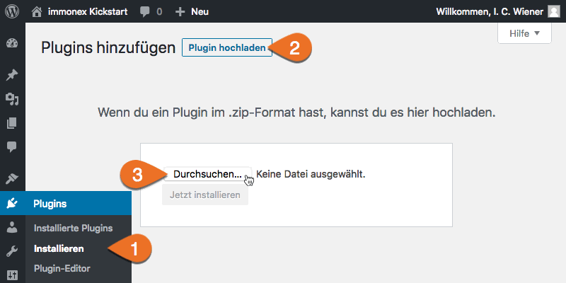

# Installation

## Automatisch

immonex Kickstart Team ist im offiziellen [WordPress-Plugin-Verzeichnis](https://de.wordpress.org/plugins/immonex-kickstart-team/) verfügbar und kann über die Suche unter ***Plugins → Installieren*** automatisiert heruntergeladen und installiert werden.

## Manuell

Das Plugin kann alternativ auch via ***Plugins → Installieren → Plugin hochladen*** als ZIP-Datei manuell installiert oder aktualisiert werden (bspw. eine noch nicht im WordPress-Plugin-Verzeichnis verfügbare Beta-Version, die von [immonex.dev](https://immonex.dev/) heruntergeladen wurde).

> Alle Agentur- und Kontaktpersonen-Datensätze sowie Plugin-Einstellungen bleiben auch beim Deaktivieren/Löschen erhalten und werden bei der Installation der neuen Version übernommen.

Im Anschluss an den Upload und die Installation muss das Plugin noch per Klick auf den angezeigten Button oder den entsprechenden Link in der Plugin-Liste **aktiviert** werden.

Nach erfolgreicher Installation und Aktivierung sind die neuen [Beitragsarten](../beitragsarten) verfügbar und es geht weiter mit der [grundlegenden Einrichtung](einrichtung)...
